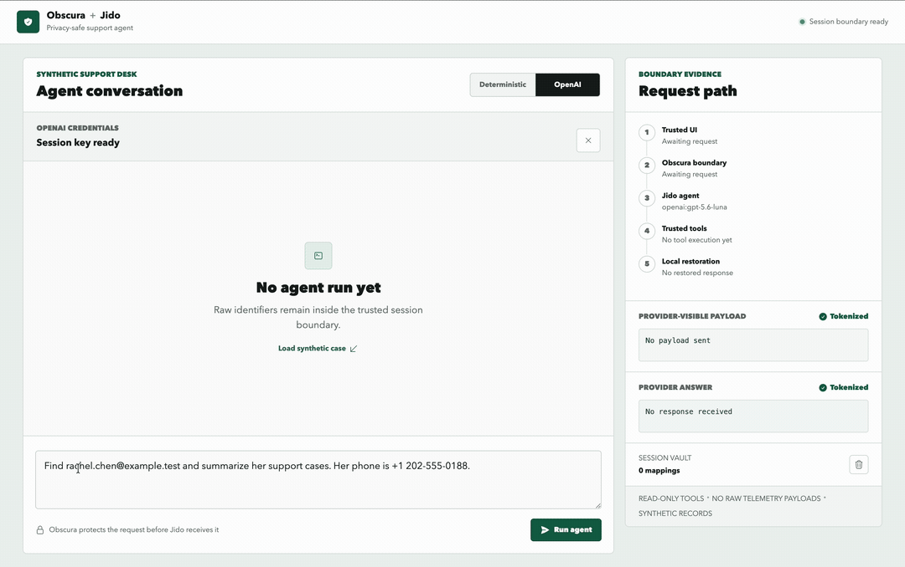

# Obscura + Jido Example

A Phoenix LiveView demonstration of a tool-using Jido support agent whose
OpenAI boundary receives pseudonyms for configured identifiers instead of
their raw values.

[](docs/media/obscura-jido-demo.mp4)

*Raw identifiers remain inside the trusted application. Jido and OpenAI
operate on stable pseudonyms, and known values are restored only in the
trusted UI. Select the preview to watch the complete demonstration.*

The example uses synthetic customer records and read-only tools. It shows how
to combine:

- Obscura's deterministic PII detection and session-scoped vault;
- reversible pseudonymization before an agent or model sees a request;
- bounded multi-turn context containing only protected prompts and tokenized answers;
- trusted tool execution with locally rehydrated lookup keys;
- protected tool results and local response rehydration;
- payload-free Jido and ReqLLM telemetry settings;
- Phoenix parameter filtering for LiveView lifecycle logs.

## Boundary

```text
Browser (raw request)
        |
        v
Obscura + session vault
        |  <<EMAIL_001>>, <<PHONE_001>>
        v
Bounded protected history -----> Jido agent
                                      |  \
                                      |   +--> OpenAI or deterministic model boundary
                                      v
Trusted read-only tools
        |  rehydrate lookup key locally, protect returned PII
        v
Jido answer with pseudonyms
        |
        v
Local rehydration -> trusted LiveView
```

Each request runs in a fresh Jido process. Before a follow-up request starts,
the application restores at most six completed turns into that process using
only protected prompts and tokenized provider answers. Raw prompts and restored
answers remain in the trusted LiveView transcript. This lets the model reuse a
stable reference such as `<<EMAIL_001>>` across turns without receiving the
underlying email address.

The trusted local Jido runtime holds the vault PID only as tool context. The
PID and its mappings are not included in provider-visible prompts or tool
payloads, so the remote model never receives the vault or a raw customer
record. Tool schemas accept only a session pseudonym or a synthetic customer
reference. The vault and bounded conversation exist for one connected LiveView
session. Starting a new conversation clears both while leaving the separately
managed OpenAI session credential unchanged.

## Run Locally

Install dependencies and assets:

```bash
mix setup
```

Start Phoenix:

```bash
mix phx.server
```

Open [http://localhost:4000](http://localhost:4000). The deterministic mode
works without credentials and still exercises the real Jido runtime and both
tools. Only the model response is scripted.

## Obscura 0.2.0 and optional native CPU recognition

This example consumes `{:obscura, "~> 0.2.0"}` from Hex. The default
`OBSCURA_JIDO_PROFILE=fast` keeps setup free of model assets. To also recognize
English person/location spans in prompts and case notes, provision `:efficient`
on Apple Silicon macOS or glibc Linux x86-64/ARM64.

Install PCRE2 (`brew install pcre2` on macOS) or the Linux runtime libraries
(`apt-get install curl libopenblas0-pthread libpcre2-8-0`), and uv **0.12.1**:

```sh
mix obscura.efficient.install --allow-download
OBSCURA_JIDO_PROFILE=efficient mix phx.server
```

The application supervisor starts one reusable native CPU runtime. Set
`OBSCURA_JIDO_WORKERS=2` to use two workers (allowed range 1–4; default 1).
`OBSCURA_EFFICIENT_ASSET_DIR` selects an already provisioned asset directory.
No Python, Nx, Bumblebee, GPU, or network is needed for native inference.
Prebuilt Linux binaries require glibc 2.36+, LP64 OpenBLAS, and PCRE2; model
assets occupy about 408 MiB. See the [installation and contract guide](https://hexdocs.pm/obscura/0.2.0/efficient.html).

The runtime is shared across requests while vaults remain session-scoped.
Select the profile at application startup so a conversation keeps a consistent
recognition policy. Requests fail before the agent receives a prompt if native
preparation is incomplete or fails; model errors and saturation also return
errors, with no fallback to `:fast`. Correct missing assets before restarting
the application. Provisioning never runs from a browser request.

Known customer fields retain their explicit protection. Native recognition can
miss names/locations or select inaccurate spans; it does not provide exhaustive
PII protection. Existing email/phone pseudonyms and local rehydration continue
to work in either mode.

After provisioning, run the real native boundary tests:

```sh
OBSCURA_EFFICIENT_TEST=1 mix test test/obscura_jido_example/efficient_privacy_test.exs
```

## Use OpenAI

The default model is `openai:gpt-5.6-luna`. Override it with any ReqLLM model
identifier that supports tool calls.

For a local demonstration, enter a key in the OpenAI access panel. The
form sends it through a CSRF-protected HTTP request whose parameters are
filtered from Phoenix logs. The key is copied into process-owned memory,
expires after 30 minutes of inactivity, and is never written to the session
cookie. The cookie contains only an opaque reference. Clearing the key or
restarting the application removes it. For OpenAI runs, Jido keeps streaming
directly through ReqLLM and Finch. Jido state and telemetry carry only the
opaque reference and a harmless placeholder. A ReqLLM Finch request adapter
resolves the key immediately before transmission, removes the internal
reference header, and leaves Finch to stream the provider response directly.

The OpenAI control remains disabled unless the browser session contains a valid
reference to an in-memory key. `OPENAI_API_KEY` is intentionally ignored so the
demonstration has one explicit credential boundary. This in-memory form is not
a replacement for a production secrets manager. Do not commit API keys or place
them in prompts.

## Verify

```bash
mix precommit
mix assets.build
```

The test suite verifies that:

- provider-bound prompts and answers contain pseudonyms, not raw canaries;
- follow-up model requests receive bounded protected history and no raw transcript values;
- trusted tools rehydrate only the lookup value they require;
- tool results are protected before returning to Jido;
- the trusted UI can restore known mappings;
- Logger and core Jido telemetry do not contain the raw test values;
- LiveView event parameters are filtered before Phoenix logs them;
- OpenAI cannot be selected without an explicit session credential;
- ReqLLM invokes the credential adapter and Finch relays SSE chunks directly;
- expired session references fail closed without contacting OpenAI.

## Scope

This is an architecture demonstration, not a production support system. The
records are synthetic, tools are read-only, and deterministic mode does not
measure model quality. By default, free-form prompts use the `:fast` profile for configured
structured entities such as email addresses and phone numbers; they do not
provide general contextual name detection. Names in the synthetic tool records
are protected by an explicit field policy instead. The simplified case lookup
also trusts a synthetic customer reference and is not a production
authorization design. A real application must authorize every tool operation
and scope references to the requesting principal.

The tests cover the configured boundaries; they do not prove that arbitrary
future dependencies or application logs cannot expose data. Review telemetry,
error reporting, tracing, persistence, authorization, and model-provider
retention policies for a real deployment.

## Projects

- [Obscura](https://github.com/hfiguera/obscura)
- [Jido](https://github.com/agentjido/jido)
